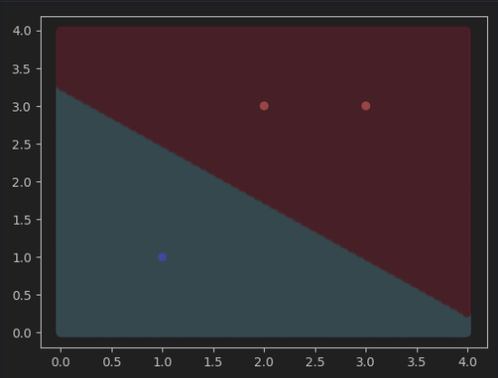
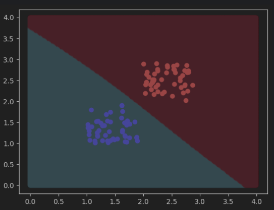
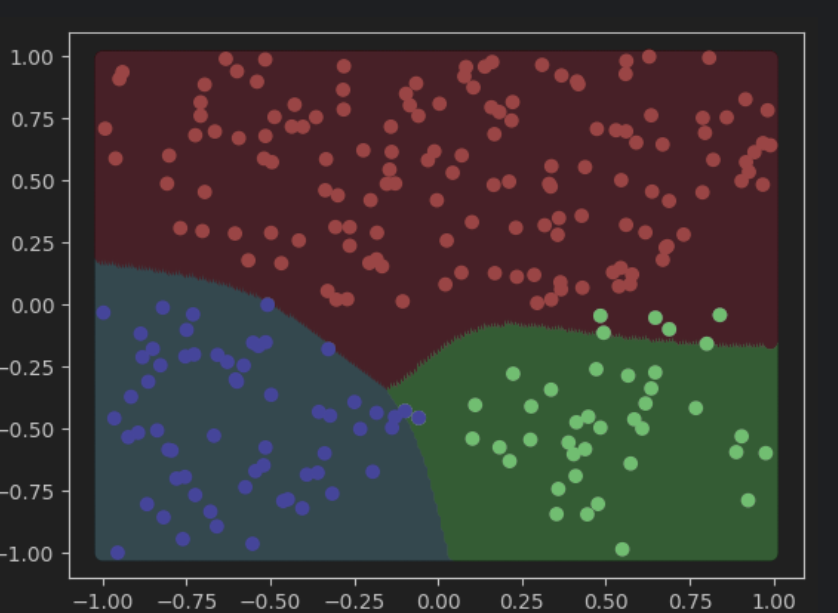
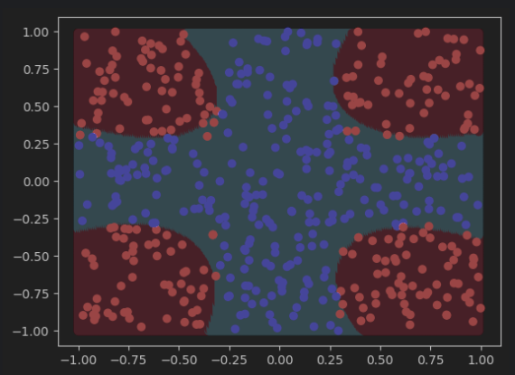
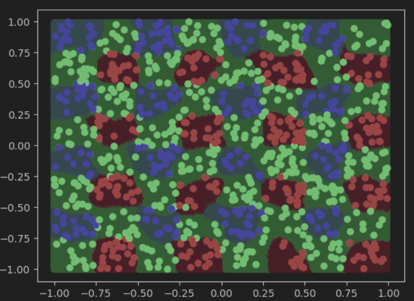
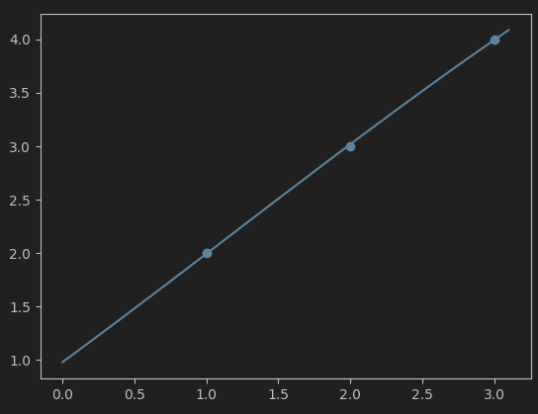
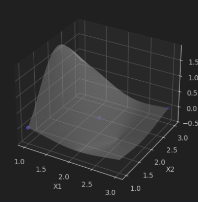
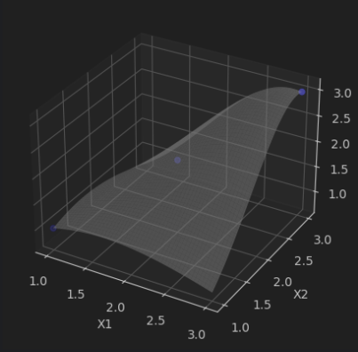
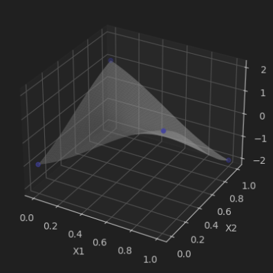

## Introduction

Nous avons implémenté plusieurs approches incluant la règle de Rosenblatt pour la classification, l'algorithme de Lloyd (qui donne K-means) pour la configuration des centres des RBF, 
ainsi que la régression inverse/pseudo-inverse pour la régression pour le rbf. 
Les sections suivantes détaillent ces méthodes et présentent les cas de tests réalisés.

## Méthodes Utilisées

### Classification

Pour la classification, nous avons utilisé deux méthodes principales :

1. **Règle de Rosenblatt** :
    - Algorithme de classification linéaire utilisé pour séparer les classes en utilisant des fonctions de base radiales (RBF).
    - Mise à jour des poids :

         
2. **Algorithme de Lloyd (K-means)** :
    - Utilisé pour déterminer les centres des RBF de manière non supervisée.
    - Les centres des RBF sont ajustés pour minimiser la distance intra-cluster et maximiser la distance inter-cluster.

### Régression

Pour la régression, nous avons utilisé la méthode de régression inverse/pseudo-inverse :

- **Régression Inverse/Pseudo-Inverse** :
    - Utilisée pour ajuster les poids des RBF dans le modèle de régression.
    - Equation :

      

## Cas de Tests

Nous avons évalué nos modèles RBF sur les cas de tests suivants :

1. **Classification Linéaire Simple** (`rbf_classification_linear_simple`)
2. **Classification Linéaire Multiple** (`rbf_classification_linear_multiple`)
3. **Classification Linéaire Multiple 3 Classes** (`rbf_classification_multi_linear_3_classes`)
4. **Classification CROSS** (`rbf_classification_cross`)
5. **Classification MULTI CROSS** (`rbf_classification_multi_cross`)
6. **Classification XOR** (`rbf_classification_xor`)
7. **Régression Linéaire Simple en 2D** (`rbf_regression_linear_simple_2D`)
8. **Régression Linéaire Simple en 3D** (`rbf_regression_linear_simple_3D`)
9. **Régression Linéaire Complexe en 3D** (`rbf_regression_linear_tricky_3D`)
10. **Régression Non-Linéaire Simple en 2D** (`rbf_regression_non_linear_simple_2D`)
11. **Régression Non-Linéaire Simple en 3D** (`rbf_regression_non_linear_simple_3D`)

## Résultats et Visualisations

Pour chaque cas de test, nous avons généré et inclus des images des courbes et des graphiques résultants. Ces visualisations permettent de mieux comprendre les performances et les comportements des modèles appliqués à différents types de données.

- **rbf_classification_linear_simple** :

  

- **rbf_classification_linear_multiple** :

  

- **rbf_classification_multi_linear_3_classes** :

  

- **rbf_classification_cross** :

  

- **rbf_classification_multi_cross** :

  

- **rbf_classification_xor** :

  

- **rbf_regression_linear_simple_2D** :

  

- **rbf_regression_linear_simple_3D** :

  

- **rbf_regression_linear_tricky_3D** :

  

- **rbf_regression_non_linear_simple_2D** :

  

- **rbf_regression_non_linear_simple_3D** :

  

Pour plus de détails sur l'implémentation et les résultats, veuillez consulter le code source et les commentaires associés dans les fichiers du projet.

---

N'hésitez pas à explorer les fichiers du projet pour mieux comprendre les implémentations et les résultats obtenus !
