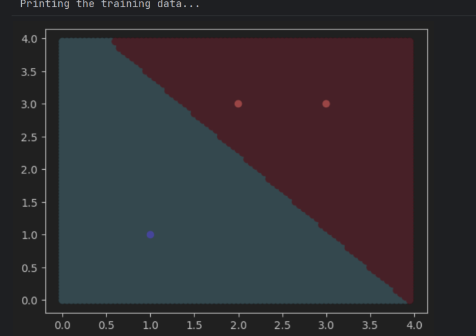
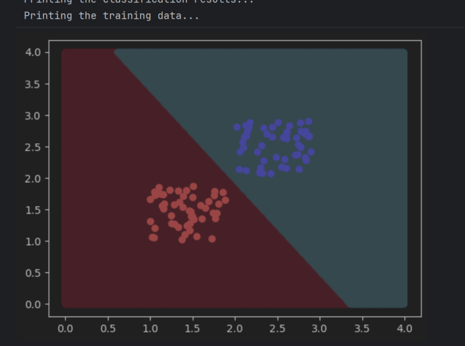
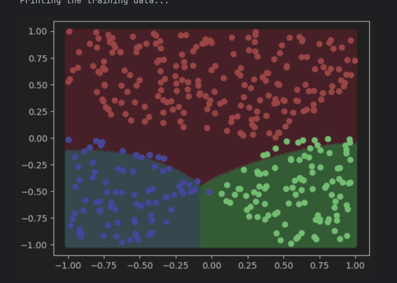
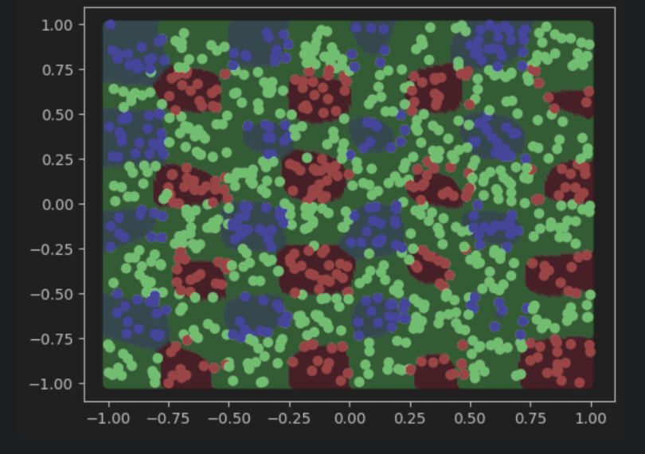
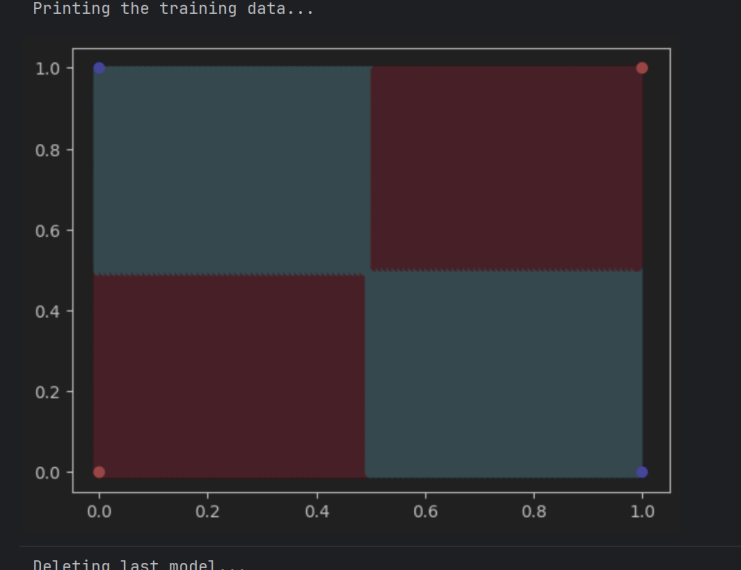
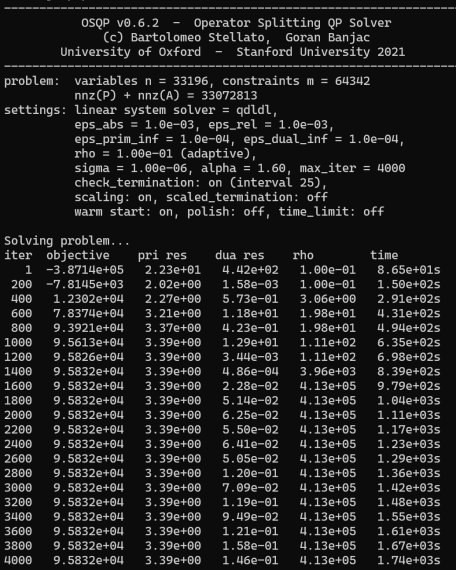
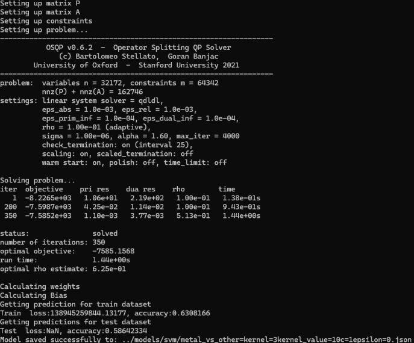
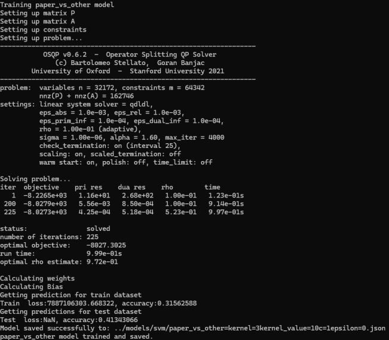
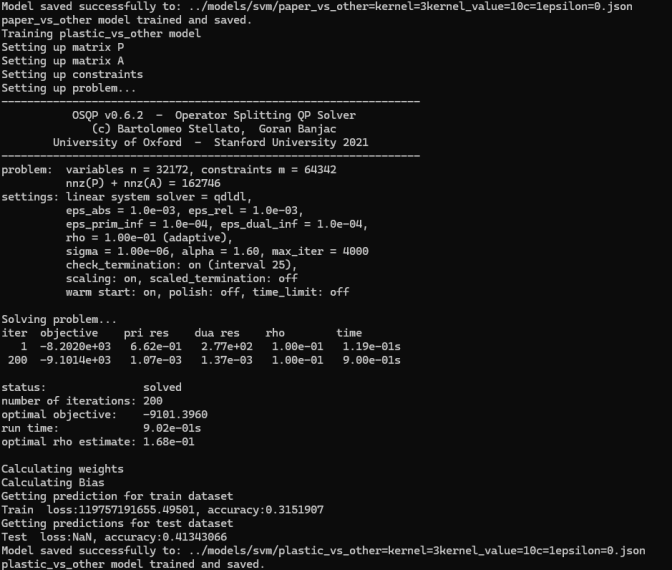

## Introduction

Nous avons implémenté et testé plusieurs cas de tests en utilisant des noyaux linéaires pour séparer les classes. 
Les sections suivantes décrivent les méthodes utilisées et présentent les différents cas de tests réalisés.

## Méthode Utilisée

### Support Vector Machine (SVM)

Pour les tâches de classification, nous avons utilisé le SVM avec des noyaux linéaires pour séparer les données :

- **SVM avec Noyau Linéaire** :
    - Utilisé pour maximiser la marge entre les classes en utilisant un hyperplan linéaire.
    - L'optimisation est réalisée pour trouver l'hyperplan qui maximise la distance aux points les plus proches de chaque classe.

## Cas de Tests

Nous avons évalué notre modèle SVM sur les cas de tests suivants :

1. **Classification Linéaire Simple** (`svm_classification_linear_simple`)
2. **Classification Linéaire Multiple** (`svm_classification_linear_multiple`)
3. **Classification Multi-Linéaire 3 Classes** (`svm_classification_multi_linear_3_classes`)
4. **Classification CRO** (`svm_classification_cross`)
5. **Classification Multi-CRO** (`svm_classification_multi_cross`)
6. **Classification XOR** (`svm_classification_xor`)

## Résultats et Visualisations

Pour chaque cas de test, des visualisations ont été générées pour illustrer la capacité du SVM à séparer les classes avec un noyau linéaire :

- **svm_classification_linear_simple** :

  

- **svm_classification_linear_multiple** :

  

- **svm_classification_multi_linear_3_classes** :

  

- **svm_classification_cross** :

  

- **svm_classification_multi_cross** :

  

- **svm_classification_xor** :

  

---

Le modèle SVM utilisant un noyau linéaire a démontré des difficultés de convergence, nécessitant un nombre d'itérations supérieur à 4000 
pour atteindre une solution satisfaisante. Cette observation suggère que la complexité du problème pourrait dépasser les capacités de séparation 
linéaire du modèle dans l'espace des caractéristiques actuel.

   

Une première expérimentation du modèle SVM a été réalisée en utilisant un noyau RBF, avec les hyperparamètres gamma = 10 et C = 1. Cette configuration, exploitant le 'kernel trick', 
a produit des résultats initiaux avec une précision (accuracy) d'environ 0,6.
Ces résultats préliminaires, bien que prometteurs, suggèrent qu'il existe une marge d'amélioration potentielle. 
Une exploration plus approfondie de l'espace des hyperparamètres s'avère nécessaire pour optimiser les performances du modèle. Des expérimentations supplémentaires avec différentes valeurs de gamma et 
C sont recommandées pour affiner le modèle et potentiellement améliorer sa précision.

   

   

   

---

Pour plus de détails sur l'implémentation et les résultats, veuillez consulter le code source et les commentaires associés dans les fichiers du projet.

---

N'hésitez pas à explorer les fichiers du projet pour mieux comprendre les implémentations et les résultats obtenus !
